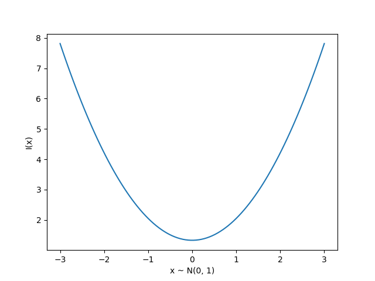

<!-- 
_class: invert lead
_paginate: skip
 -->

# Classification loss functions and metrics

COMP 4630 | Winter 2025
Charlotte Curtis

---

## Overview
- All the derivation thus far has been for mean squared error
- **Cross-entropy loss** is more appropriate for classification problems
- References and suggested reading:
    - [Scikit-learn book](https://librarysearch.mtroyal.ca/discovery/fulldisplay?context=L&vid=01MTROYAL_INST:02MTROYAL_INST&search_scope=MRULibrary&isFrbr=true&tab=MRULibraryResources&docid=alma9923265933604656): Chapter 4, training models
    - [Scikit-learn docs](https://scikit-learn.org/stable/modules/model_evaluation.html#log-loss): Log loss
    - [Deep Learning Book](https://www.deeplearningbook.org/): Sections 3.1, 3.8, and 6.2

---

## Statistics review: Expected value
The **expected value** of some function $f(x)$ when $x$ is distributed as $P(x)$ is given in discrete form as:
    
$$\mathbb{E}[f(x)] = \sum_{x} P(x)f(x)$$

where the sum is over all possible values of $x$.

In continuous form, this is an integral:

$$\mathbb{E}[f(x)] = \int p(x)f(x)dx$$

---

## Binary case: Bernoulli distribution
* If a random variable $x$ has a $p$ probability of being 1 and a $1-p$ probability of being 0, then $x$ is distributed as a **Bernoulli distribution**:
  $$P(x) = p^x(1-p)^{1-x} = \begin{cases} p & \text{for } x=1 \\ 1-p & \text{for } x=0 \end{cases}$$
* The expected value of $x$ is then:
    $$\mathbb{E}[x] = 0 \cdot (1-p) + 1 \cdot p = p$$

---

## Information theory
Originally developed for message communication, with the intuition that less likely events carry more **information**, defined for a single event as:
    
$$I(x) = -\log P(x)$$

---

## Entropy

* We can measure the **expected information** of a distribution $P(x)$ as:
    $$H(X) = \mathbb{E}[I(x)] = -\mathbb{E}_{x \sim P}[\log P(x)]$$
* This is called the **Shannon entropy**
* Measured in bits (base 2) or nats (base $e$)
* :abacus: Find the entropy of a bernoulli distribution

---

## Cross-entropy
* The **KL divergence** is a measure of the *extra* information needed to encode a message from a true distribution $P(x)$ using an approximate distribution $Q(x)$:
    $$D_{KL}(P||Q) = \mathbb{E}_{x \sim P}\left[\log \frac{P(x)}{Q(x)}\right] = \mathbb{E}_{x \sim P}[\log P(x) - \log Q(x)]$$
* The **cross-entropy** is a simplification that drops the term $\log P(x)$:
    $$H(P, Q) = -\mathbb{E}_{x \sim P}[\log Q(x)]$$
* Minimizing the cross-entropy is equivalent to minimizing the KL divergence
* If $P(x) = Q(x)$, then $D_{KL}(P||Q) = 0$ and $H(P, Q) = H(P)$

---

## Cross-entropy loss

For a true label $y \in \{0, 1\}$ and predicted $\hat{p} \in [0, 1]$, the cross-entropy loss is:

$$\begin{aligned}\mathcal{L}(y, \hat{p}) =& -\mathbb{E}_{y}[\log P(x)]\\ 
=& -y \log \hat{p} - (1-y) \log (1-\hat{p})\end{aligned}$$

where $\hat{p} = \sigma(\mathbf{w}^T\mathbf{h} + b)$ is the output of the final layer of a neural network (thresholded to obtain the prediction $\hat{y}$)

> This is also called **log loss** or **binary cross-entropy**

---

## Multiclass case
* For $K$ classes, the output is a vector $\mathbf{\hat{p}}$ with $\hat{p}_i = P(y=i|\mathbf{x})$
* The cross-entropy loss is then:
    $$\mathcal{L}(\mathbf{y}, \mathbf{\hat{p}}) = -\sum_{i=1}^K y_i \log \hat{p}_i$$
* For a one-hot encoded vector $\mathbf{y}$, this simplifies to:
    $$\mathcal{L}(\mathbf{y}, \mathbf{\hat{p}}) = -\log \hat{p}_k$$
    where $k$ is the index of the true class

---

## The softmax function
* For binary classification, the sigmoid function $\sigma(z) = \frac{1}{1+e^{-z}}$ is used to predict the probability of the positive class
* For multiclass classification, the **softmax function** is used:

    $$\hat{p}_i = \frac{e^{z_i}}{\sum_{j=1}^K e^{z_j}}$$

    where $z_i = \mathbf{w}_i^T\mathbf{h} + b_i$ is the output of neuron $i$ in the final layer before the activation function is applied
* This means that $K$ neurons are needed in the final layer, one for each class

---

## Terminology for evaluation
- **True positive**: predicted positive, label was positive ($TP$) ✔️ 
- **True negative**: predicted negative, label was negative ($TN$) ✔️
- **False positive**: predicted positive, label was negative ($FP$) ❌ (type I)
- **False negative**: predicted negative, label was positive ($FN$) ❌ (type II)
* **Accuracy** is the fraction of correct predictions, given as:

    $$\mathrm{accuracy} = \frac{TP + TN}{TP + TN + FP + FN}$$

---

## Precision and recall
* **Precision**: Out of all the positive **predictions**, how many were correct?
  $$\mathrm{precision} = \frac{TP}{TP + FP}$$

* **Recall**: Out of all the positive **labels**, how many were correct?
  $$\mathrm{recall} = \frac{TP}{TP + FN}$$

* **Specificity**: Out of all the negative **labels**, how many were correct?
  $$\mathrm{specificity} = \frac{TN}{TN + FP}$$
  
---

## Confusion matrix

|                   | Predicted Positive | Predicted Negative |
| ----------------- | ------------------ | ------------------ |
| **True Positive** | TP                 | FN                 |
| **True Negative** | FP                 | TN                 |

* The axes might be reversed, but a good predictor will have strong diagonals
* There's also the **F1 score**, or harmonic mean of precision and recall:
    $$F1 = 2 \cdot \frac{\mathrm{precision} \cdot \mathrm{recall}}{\mathrm{precision} + \mathrm{recall}}$$

<footer>Check out the <a href="https://en.wikipedia.org/wiki/Confusion_matrix">Wikipedia page</a> for more ways of describing the same information</footer>

---

## ROC Curves
* The [receiver operating characteristic](https://en.wikipedia.org/wiki/Receiver_operating_characteristic) curve is a plot of the **true positive rate** (recall or sensitivity) vs. **false positive rate** (1 - specificity) as the detection threshold changes

* The diagonal is the same as random guessing
* A perfect classifier would hug the top left corner

> Fun fact: the name comes from WWII radar operators, where true positives were airplanes and false positives were noise

---

## Which classifier is better?

---

<!-- 
_class: invert lead
_paginate: skip
 -->

# Next up: Convolution and NN frameworks