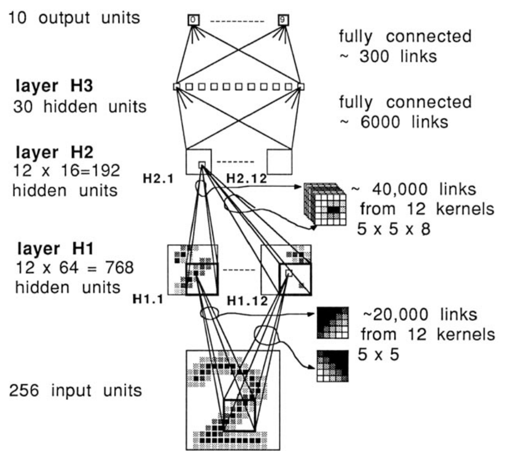
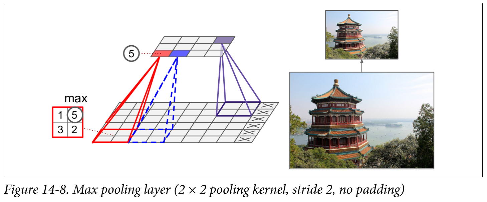
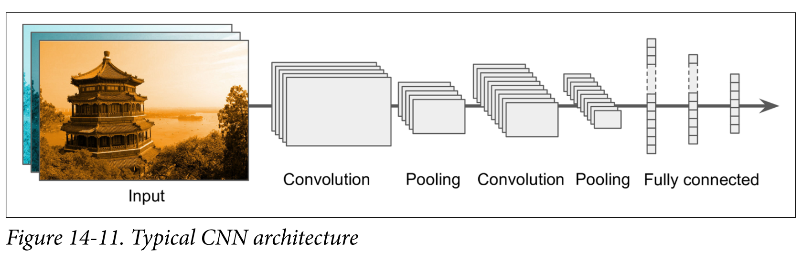
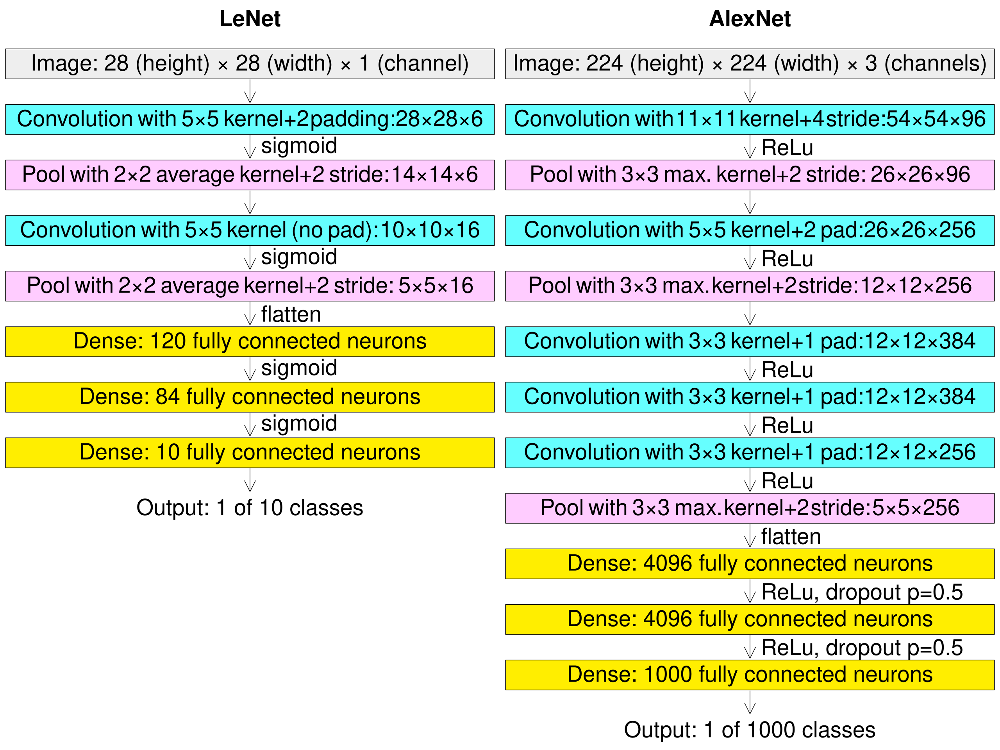
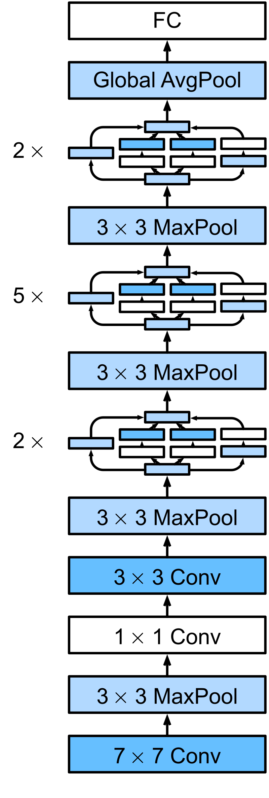
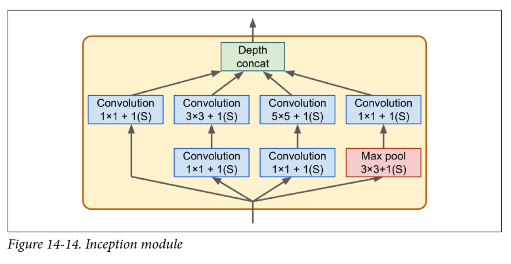
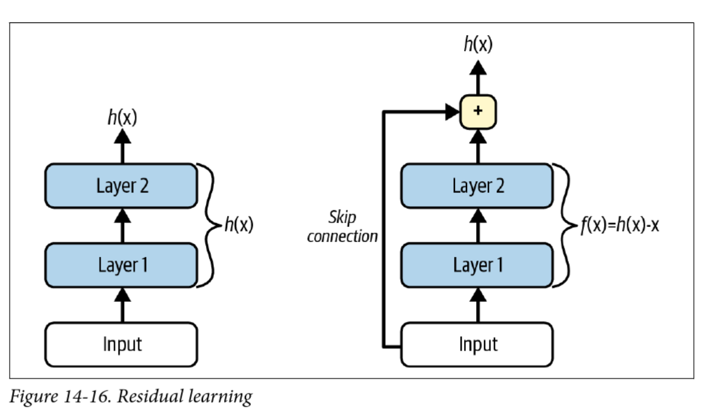

<!-- 
_class: invert lead
_paginate: skip
 -->

# Convolution and Convolutional Neural Networks

COMP 4630 | Winter 2025
Charlotte Curtis

---

## Overview
* **Convolutional neural networks** (CNNs) are a type of neural network that is particularly well-suited to image data
* Before we can understand CNNs, we need to understand **convolution**
* References and suggested reading:
    - [Scikit-learn book](https://librarysearch.mtroyal.ca/discovery/fulldisplay?context=L&vid=01MTROYAL_INST:02MTROYAL_INST&search_scope=MRULibrary&isFrbr=true&tab=MRULibraryResources&docid=alma9923265933604656): Chapter 14
    - [Deep Learning Book](https://www.deeplearningbook.org/): Chapter 9
    - [3blue1brown video](https://www.youtube.com/watch?v=KuXjwB4LzSA): What is convolution?
---

## Convolution
* **Convolution** is defined as:
    $$(f * g)(t) = \int_{-\infty}^{\infty} f(\tau)g(t-\tau)d\tau$$

* Or in the discrete case:
    $$(f * g)[n] = \sum_{m=-\infty}^{\infty} f[m]g[n-m]$$

* Can be though of as "flipping" one function and sliding it over the other, multiplying and summing at each point

---

## Example

We're in a hospital dealing with an outbreak. For the first 5 days we have 1 patient on Monday, 2 on Tuesday, etc:

$$\mathrm{patients}(x) = \begin{bmatrix}1, 2, 3, 4, 5\end{bmatrix}$$

Fortunately, we know how to treat them: 3 doses on day 1, then 2, then 1:

$$\mathrm{doses}(x) = \begin{bmatrix}3, 2, 1\end{bmatrix}$$

And after 3 days they're cured.

How many doses do we need on each day?

<footer>Hospital example taken from <a href="https://betterexplained.com/articles/intuitive-convolution/">here</a></footer>

---

## Convolution in 2D
* Extending to 2D basically adds another summation/integration:
  $$\begin{aligned}(f * g)[n, m] =& \sum_{i=-\infty}^{\infty}\sum_{j=-\infty}^{\infty} f[i, j]g[n-i, m-j]\\
  (f * g)(x, y) =& \int_{-\infty}^{\infty}\int_{-\infty}^{\infty} f(u, v)g(x-u, y-v)dudv\end{aligned}$$
* This can also be extended to higher dimensions
* Caution: a **colour image** is a 3D array, not a 2D array
* For typical image processing applications, the **colour channels** are convolved **independently** such that the output is still a 3D array

---

## Convolution kernels

* Typically there is a small **kernel** that is convolved with the input
* This is just the smaller of the two functions in the convolution
* :question: What happens at the edges of the input?

<footer>By Michael Plotke - Own work, CC BY-SA 3.0, <a href="https://commons.wikimedia.org/w/index.php?curid=24288958">From Wikipedia</a></footer>

---

## Some common kernels

* Averaging:
$$\frac{1}{9}\begin{bmatrix}1 & 1 & 1\\1 & 1 & 1\\1 & 1 & 1\end{bmatrix}$$
* Differentiation: 
 $$\begin{bmatrix}-1 & 0 & 1\\-1 & 0 & 1\\-1 & 0 & 1\end{bmatrix}$$

* Sizes are commonly chosen to be 3x3, 5x5, 7x7, etc.
* :question: Why divide by 9?
* :question: Why odd sizes?
* :question: What effect do you think these kernels will have on an image?

---

## A side tangent on frequency representation
* Any signal can be represented as a weighted summation of sinusoids
* For a discrete signal $x[n]$, you can think of this as:
  $$x[n] = \sum_{k=0}^{N-1}a_k\cos\left(\frac{2\pi k n}{N}\right) + b_k\left(\frac{2\pi k n}{N}\right)$$
* Or, using Euler's formula $e^{j\theta} = \cos\theta + j\sin\theta$:
  $$x[n] = \sum_{k=0}^{N-1}c_k e^{j\frac{2\pi k n}{N}}$$
  where the complex coefficients $c_k = a_k + jb_k$

<footer>j is the same as i, but in engineering</footer>

---

## Fourier Transform
* To figure out what the coefficients $c_k$ are, we can use the **Discrete Fourier Transform** (DFT):
  $$X[k] = \sum_{n=0}^{N-1}x[n]e^{-j\frac{2\pi k n}{N}}$$
  where each element of $X[k]$ is the coefficient $c_k$ for frequency $k$
* The **Fast Fourier Transform** (FFT) computes the DFT in $O(n\log n)$ time
* Convolution is $O(n^2)$

---

## Convolution is multiplication in frequency
* Sometimes it is useful to use the **Fourier Transform** to obtain a frequency representation of an image (or signal)
* In the frequency domain, convolution is simply element-wise multiplication
* This allows for some efficient operations such as blurring/sharpening an image, as well as some fancy stuff like **deconvolution**
* Sharp edges in space become **ringing** in frequency, and vice versa
* :question: why do CNNs operate in the spatial domain?

---

## Convolutional neural networks

* 1958: Hubel and Wiesel experiment on cats and reveal the structure of the visual cortex
* Determine that specific neurons react to specific features and **receptive fields**
* Modelled in the "neocognitron" by Kunihiko Fukushima in 1980
* LeCun's work in the 1990s led to modern CNNs

---

## Why CNNs?
* A fully connected network has a 1:1 mapping of weights to inputs
* Fine for MNIST (28x28) pixels, but quickly grows out of control
* :question: If you train a (fully connected) network on 100x100 images, how would you infer on 200x200 images?
* :question: What if an object is shifted, rotated, or flipped within the image?
   

<footer>Bluey image used without permission from <a href="https://www.bluey.tv/">bluey.tv</a>

---

## Convolutional layers
* A **convolution layer** is a set of kernels whose weights are learned
* Instead of the straight up weighted sum of inputs, the input image is convolved with the learned kernel(s)
* The output is often referred to as a **feature map**
* The dimensionality of the feature map is determined by the:
    - Size of the input image
    - Number of kernels
    - Padding (usually "same" or "valid")
    - "Stride", or shift of the kernel at each step

---

## Dimensionality examples

| Input | Kernel | Stride | Padding | Output |
|-------|--------|--------|---------| ------ | 
| $100 \times 100 \times 3$ | $5 \times 5 \times 32$ | 1 | same | $100 \times 100 \times 32$ |
| $100 \times 100 \times 1$ | $5 \times 5 \times 32$ | 2 | same | $50 \times 50 \times 32$ |
| $100 \times 100 \times 3$ | $5 \times 5 \times 32$ | 1 | valid | ??? |

* The number of channels has no impact on the depth of the output: the number of **kernels** determines the depth of the output
* The colour channels are convolved independently, then summed

---

## Number of parameters example
* Input: $100 \times 100 \times 3$
* Kernel: $5 \times 5 \times 32$
* Bias terms: 32
* Total parameters: $5 \times 5 \times 3 \times 32 + 32 = 2430$

> While convolution only happens in 2D, the kernel can be thought of as a 3D volume - there's a separate trainable kernel for each channel

---

## Pooling layers
**Pooling layers** are used to reduce the dimensionality of the feature maps (aka **downsampling**) by taking the maximum or average of a region

  

* :question: Why would we want to downsample?

<footer>Figure from <a href="https://librarysearch.mtroyal.ca/discovery/fulldisplay?context=L&vid=01MTROYAL_INST:02MTROYAL_INST&search_scope=MRULibrary&isFrbr=true&tab=MRULibraryResources&docid=alma9923265933604656">Scikit-learn book</a></footer>

---

## Putting it all together

<footer>Figure from <a href="https://librarysearch.mtroyal.ca/discovery/fulldisplay?context=L&vid=01MTROYAL_INST:02MTROYAL_INST&search_scope=MRULibrary&isFrbr=true&tab=MRULibraryResources&docid=alma9923265933604656">Scikit-learn book</a></footer>

---

## Backpropagating CNNs

* After backpropagating through the fully connected head, we need to backpropagate through the:
  - Pooling layer
  - Convolution layer
* The **pooling layer** has no learnable parameters, but it needs to remember which input was maximum (all the rest get a gradient of 0)
* The convolution layer is trickier math, but it ends up needing another convolution - this time with the kernel **transposed**

---

## LeNet (1998) vs AlexNet (2012)

<footer>Source: <a href="https://en.wikipedia.org/wiki/AlexNet">Wikipedia</a></footer>

---

## Inception v1 aka GoogLeNet (2014)

 

- Struggled with vanishing gradients
- v2 introduced batch normalization

<footer>Source: <a href="https://en.wikipedia.org/wiki/Inception_(deep_learning_architecture)">Wikipedia</a></footer>

---

## VGG (2014)

- Simple architecture, but "very" deep (16 or 19 layers)
- Fixed the convolution hyperparameters and focused on depth

---

## ResNet (2015)

* Key innovation: easier to learn "identity" functions ($f(x) = x$)
* If a layer outputs 0, it doesn't kill the gradient
* Even deeper, e.g. ResNet-152

---

## References
- [AlexNet paper](https://papers.nips.cc/paper_files/paper/2012/hash/c399862d3b9d6b76c8436e924a68c45b-Abstract.html)
- [Inception paper](https://arxiv.org/abs/1409.4842)
- [VGG paper](https://arxiv.org/abs/1409.1556)
- [ResNet paper](https://arxiv.org/abs/1512.03385)

---

<!-- 
_class: invert lead
_paginate: skip
 -->

 ## Next up: RNNs