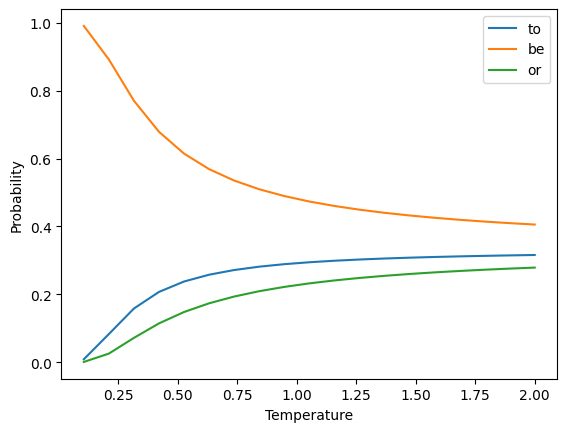
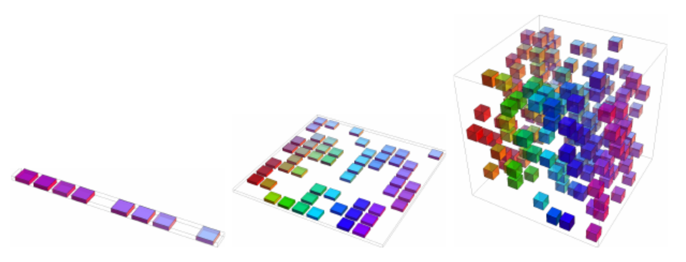
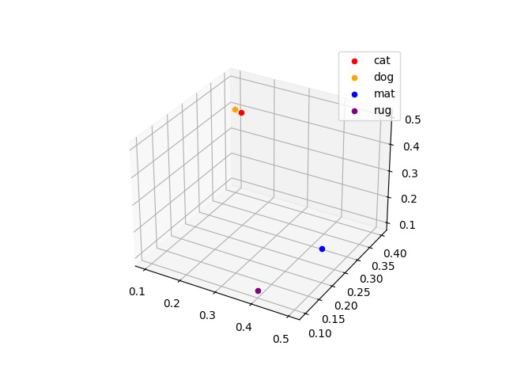
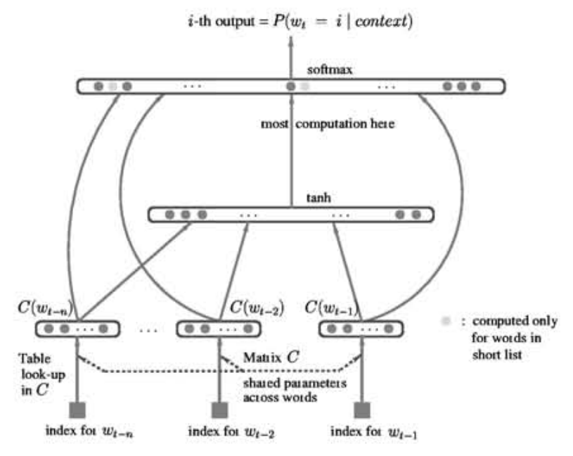
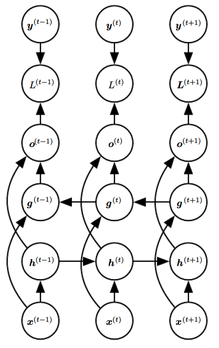
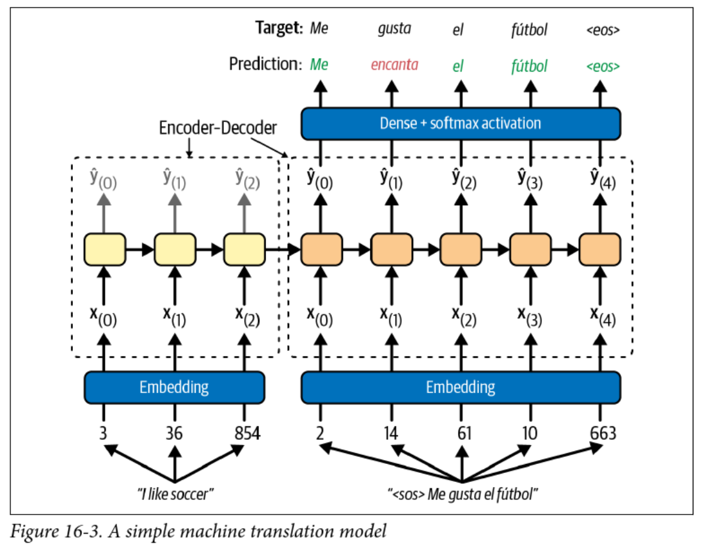

<!-- 
_class: invert lead
_paginate: skip
 -->

# Natural Language Processing

COMP 4630 | Winter 2025
Charlotte Curtis

---

## Overview

* Text to tokens
* Tokens to embeddings
* Embeddings to predictions
* References and suggested reading:
    - [Scikit-learn book](https://librarysearch.mtroyal.ca/discovery/fulldisplay?context=L&vid=01MTROYAL_INST:02MTROYAL_INST&search_scope=MRULibrary&isFrbr=true&tab=MRULibraryResources&docid=alma9923265933604656): Chapter 16
    - [Deep Learning Book](https://www.deeplearningbook.org/): Chapter 12

---

## Tokenization
* Consider the sentence:

    > "The cat sat on the mat."

* This can be split up into individual words or **tokens**:

    > ["The", "cat", "sat", "on", "the", "mat", "."]

* :question: what other ways could we tokenize this sentence?
* :question: what about punctuation, capitalization, etc.?

---

## RNN + tokens: predict the next character
* Just like predicting the next day's weather or stock price, we can predict the next character in a sentence using an RNN
* Input tokens: `['T', 'h', 'e', ' ', 'c', 'a', 't', ' ', 's', 'a', 't', ' ', 'o', 'n', ' ', 't', 'h', 'e', ' ', 'm', 'a', 't', '.']`
* Numeric representation: `[20, 8, 5, 0, 3, 1, 20, 0, 19, 1, 20, 0, 15, 14, 0, 20, 8, 5, 0, 13, 1, 20, 2]`
* We could train an RNN model to predict the next character
* For more info check out [Andrej Karpathy's blog post](http://karpathy.github.io/2015/05/21/rnn-effectiveness/), one of the sources for the Scikit-learn chapter

---

## Repeatedly predicting the next character
* To predict whole sentences from a starting point, we can predict the next character and append it to the input, then predict again
* In practice this tends to get stuck in loops:
    Input: `"to be or not"`
    Output: `"to be or not to be or not to be or not..."`
* :question: how might we avoid this?
* :question: could we just predict the next whole word instead?

---

## Controlled chaos: softmax temperature

* The softmax is defined as:
  $$\text{softmax}(\mathbf{z})_i = \frac{\exp(z_i)}{\sum_{j=1}^n \exp(z_j)}$$
  where $\mathbf{z}$ is a vector of **logits**, or log probabilities
* This estimates the probability of class $i$ out of $n$ classes
* Adding a temperature parameter $T$:
  $$\text{softmax}(\mathbf{z}/T)_i = \frac{\exp(z_i/T)}{\sum_{j=1}^n \exp(z_j/T)}$$

---

## Temperature Example

* Vocab = `["to", "be", "or"]`
* Assume that the "logits" $z_i = \begin{bmatrix}2.1, 1.0, 0.5\end{bmatrix}$
* **Sample** the next word from the resulting distribution

 

---

## In the beginning, there were $n$-grams
* A simple way to represent text is as a bag of $n$-grams
* unigram: single words (aka "Bag of Words"):
    > ["the", "cat", "sat", "on", "the", "mat"]
* bigram: pairs of words:
    > ["the cat", "cat sat", "sat on", "on the", "the mat"]
* trigram: triples of words:
    > ["the cat sat", "cat sat on", "sat on the", "on the mat"]

---

## Predictive text with $n$-grams
* Given a sequence of tokens, we can predict the probability of the $n$th token given the previous $n-1$ tokens:
    $$P(x_1, \ldots, x_\tau) = P(x_1, \ldots, x_{\tau-1}) \prod_{t=n}^{\tau} P(x_t | x_{t-n+1}, \ldots, x_{t-1})$$

* Each of these conditional probabilities can be estimated from the frequency of the $n$-grams in a **corpus**
* The most likely next word is the one with the highest probability
* :question: What are some limitations of this approach?

---

## $n$-grams challenges
* $n$-grams lose the meaning of words:
    - "The cat sat on the mat"
    - "The dog sat on the rug"
* Also subject to the **curse of dimensionality**
    - Vocabulary $\mathbb{V}$ with size $|\mathbb{V}|$ leads to $|\mathbb{V}|^n$ possible $n$-grams
    - Most $n$-grams will not be present in the corpus!
* :question: Can you think of an $n$-gram modification that could help this problem?

---

## Side note: The curse of dimensionality
* Data is often represented as $n$ samples with $p$ features each
* As $p$ increases, the number of samples required to cover the space increases exponentially
* Also called $p \gg n$ problem
  

<footer>Figure 5.9 from the Deep Learning Book</footer>

---

## Word embeddings

* Alternative solution: represent individual words as vectors, or **embeddings**
* :question: How are these embeddings defined?

    

    | Word | Embedding |
    |------|-----------|
    | cat  | `[0.2, 0.3, 0.5]` |
    | dog  | `[0.1, 0.4, 0.4]` |
    | mat  | `[0.5, 0.2, 0.2]` |
    | rug  | `[0.4, 0.1, 0.1]` |

    

    

---

## Learning word embeddings
* ~~Wednesday~~ Friday we'll discuss the influential **Word2Vec** paper, but it wasn't the first time embeddings were learned as part of a network
* The concept was first presented successfully by [Bengio in 2001](https://proceedings.neurips.cc/paper_files/paper/2000/hash/728f206c2a01bf572b5940d7d9a8fa4c-Abstract.html)
  

---

## So we have embeddings, now what?

* We can use these embeddings as input to a neural network
* Applications:
    * **Sentiment analysis**: is a review/tweet/comment positive or negative?
    * **Named entity recognition**: who/what is mentioned in a text?
    * **Machine translation**: convert text from one language to another
    * **Predictive text**: what word comes next?
    * **Text generation**: create new text based on a given input

---

## Sentiment analysis
General pipeline:
* Standardize and tokenize the text
* Add an embedding layer (trainable or pre-trained)
* Add a recurrent layer, such as a GRU
* Add a dense layer with sigmoid activation

To [Colab](https://colab.research.google.com/drive/1zZj0s09NGrTj3QJZfTmeE2tINwWezshQ?usp=sharing)!

---

<!-- 
_class: invert lead
_paginate: skip
 -->

# Sequence to Sequence models

---

## Back to RNNs
* RNNs predict the future based on the past
* This is exactly what we want for predicting stock prices, weather, etc
* :question: what if we want to predict the next word in a sentence?
* :question: what about translating a sentence from one language to another?
    > Time flies like an arrow; fruit flies like a banana.
* :question: Can you think of a way to get RNNs to see the future?

---

## Bidirectional RNNs

* Simple approach: just reverse the sequence

    $$\begin{aligned}
    \mathbf{h}_t &= \mathbf{W}_x^{(f)T} \mathbf{x}_t + \mathbf{W}_{h}^T \mathbf{h}_{t-1} + \mathbf{b}^{(f)}\\
    \mathbf{g}_t &= \mathbf{W}_x^{(b)T} \mathbf{x}_t + \mathbf{W}_{g}^T \mathbf{g}_{t+1} + \mathbf{b}^{(b)}\\
    \mathbf{\hat{y}}_t &= \mathbf{h}_t + \mathbf{g}_t
    \end{aligned}$$

* :question: Drawbacks?

<footer>Figure 10.11 from the Deep Learning Book</footer>

---

## Pretrained Embeddings and transfer learning
* Embeddings like Word2Vec have been trained on large corpora
* Surely this provides a great starting point for our models!
    - :question: why might we want to use pretrained embeddings?
    - :question: what are some potential drawbacks?
* [ELMo](https://allennlp.org/elmo) was introduced in 2018 specifically to address the limitations of Word2Vec and GloVe (another popular embedding)

> "Our representations differ from traditional word type embeddings in that each token is assigned a representation that is a function of the entire input sentence. We use vectors derived from a bidirectional LSTM that is trained with a coupled language model objective on a large text corpus"

---

## Subword Tokenization
* Word embeddings are great, but still have limitations
* ELMo uses **character** tokenization to handle out-of-vocabulary words
* In between characters and words are **subwords**
  - `"This warm weather is enjoyable"`
  - `"This", "warm", "weath", "er", "is", "enjoy", "able"`
* [Byte Pair Encoding](https://en.wikipedia.org/wiki/Byte_pair_encoding) is the most common subword tokenization method, used by GPT and [BERT](https://arxiv.org/abs/1810.04805)
* :question: What are some advantages of subword tokenization?

---

## Machine Translation
| English | Spanish |
|---------|---------|
| My mother did nothing but weep | Mi madre no hizo nada sino llorar | 
| Croatia is in the southeastern part of Europe | Croacia está en el sudeste de Europa |
| I would prefer an honorable death | Preferiría una muerte honorable | 
| I have never eaten a mango before | Nunca he comido un mango |

* :question: What kind of challenges can you think of?
* :question: How might you approach this problem?

<!-- Challenges: different word order and length, special characters, grammar, idioms, etc -->
<!-- Approach: Intermediate representation -->

---

## Encoder-Decoder Models
* RNNs can convert an arbitrary length **sequence** into a fixed length **vector**
* RNNs can convert a fixed length **vector** into an arbitrary length **sequence**
* Why not use two RNNs to convert a **sequence** to a **sequence**?
* The output head is a softmax layer with one node for **each word** in the target vocabulary $\mathbb{V}$
    - :question: What problems can you think of with this approach?
    - :question: How might you address these problems?

<!-- As vocab grows, softmax is very slow. Sampled softmax is one solution -->

---

---

## Teacher Forcing
* This model uses **teacher forcing** to train the decoder
* It feels like cheating, but this involves feeding the **correct output** to the decoder at each time step
* This speeds up training and can improve performance
* Avoids the whole backpropagation through time thing and makes training of RNNs parallelizable
* :question: How would this work with LSTM/GRU cells?
* :question: What are the implications at inference time?

---

<!-- 
_class: invert lead
_paginate: skip
 -->

 # Coming up next: Attention mechanisms and Transformers