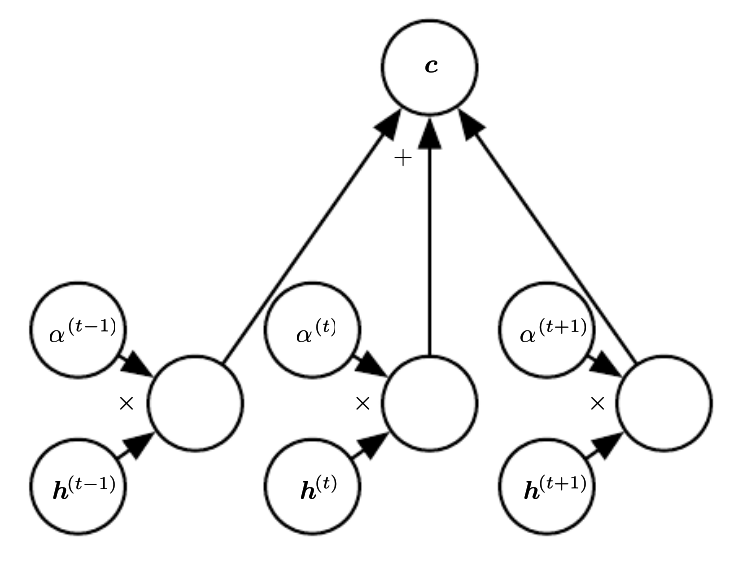
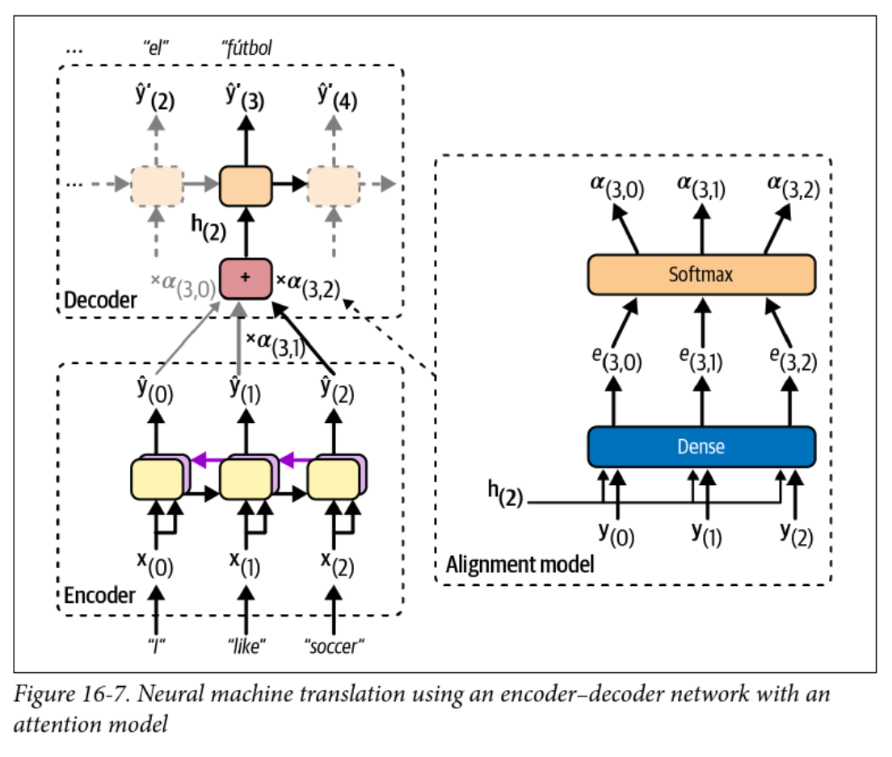
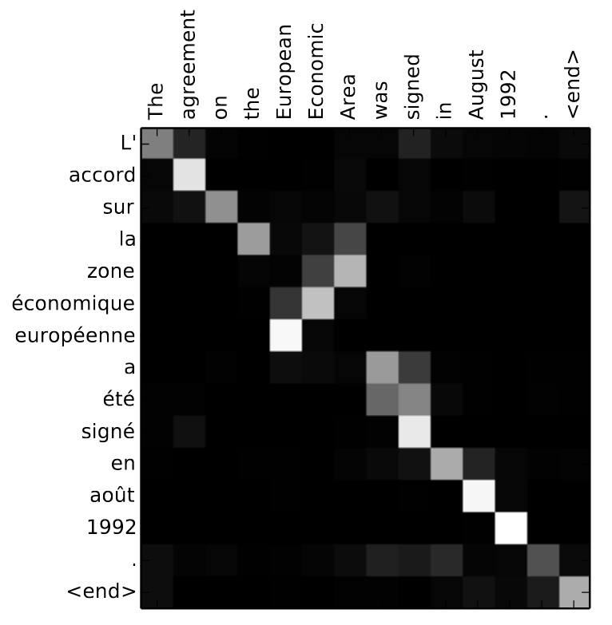
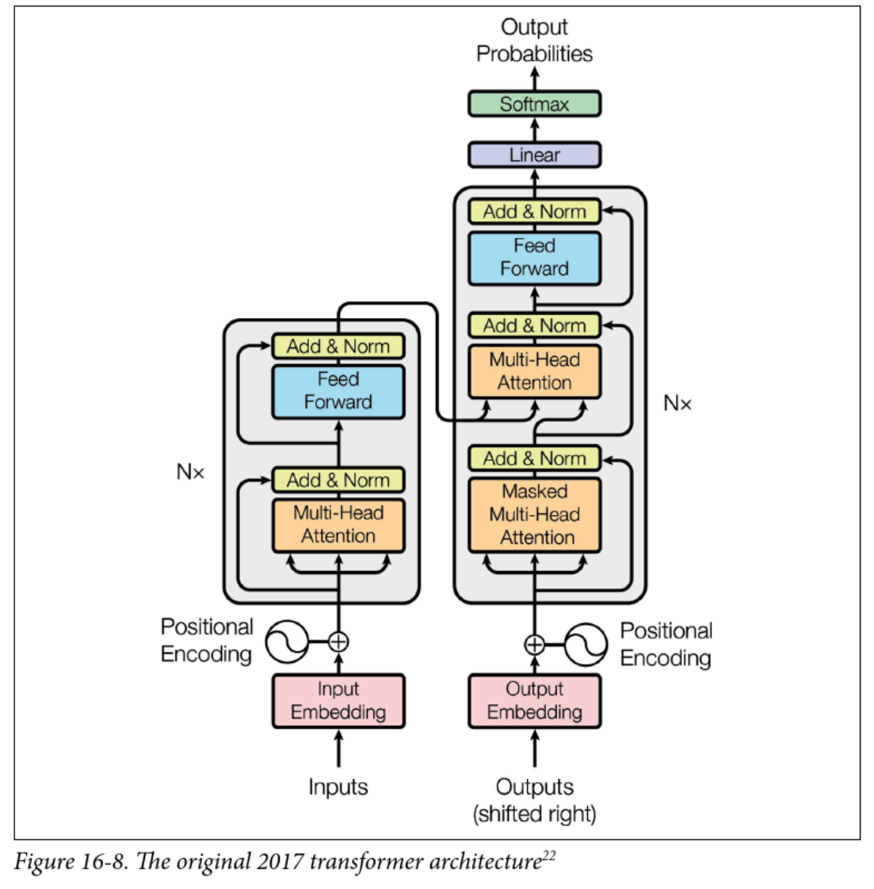
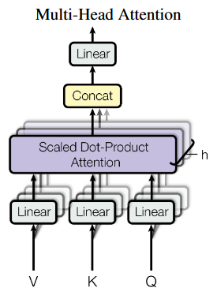
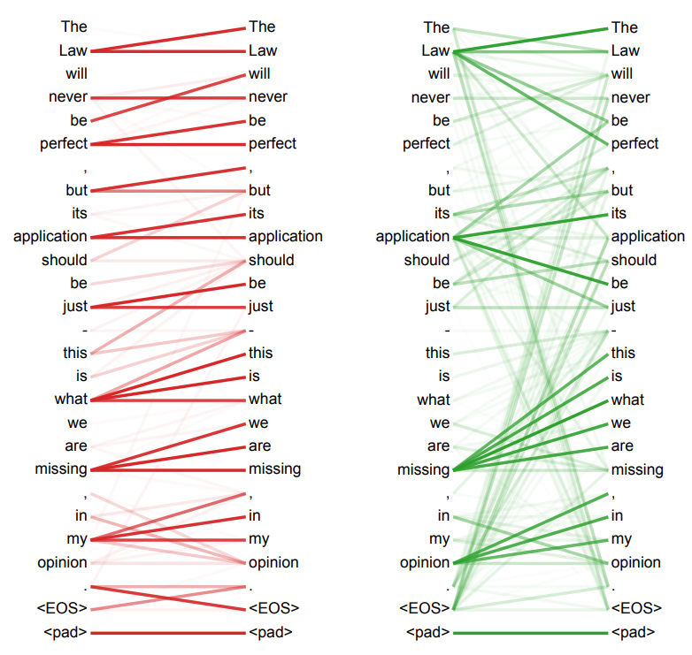

<!-- 
_class: invert lead
_paginate: skip
 -->

# Transformers and Large Language Models

COMP 4630 | Winter 2025
Charlotte Curtis

---

## Overview
* Attention mechanisms
* Transformers and large language models
    - Multi-head attention, positional encoding, and magic
    - BERT, GPT, Llama, etc.
* References and suggested readings:
    - [Scikit-learn book](https://librarysearch.mtroyal.ca/discovery/fulldisplay?context=L&vid=01MTROYAL_INST:02MTROYAL_INST&search_scope=MRULibrary&isFrbr=true&tab=MRULibraryResources&docid=alma9923265933604656): Chapter 16
    - [d2l.ai](https://d2l.ai/): Chapter 11

---

## Attention Overview

* Basically a weighted average of the encoder states, called the **context**
* Weights $\alpha$ usually come from a softmax layer
* :question: what does the use of softmax tell us about the weights?

<!-- Weights represent probability! -->

---

## Encoder-Decoder with Attention


* The **alignment model** is used to calculate attention weights
* The context vector changes at each time step!

---

## Attention Example


* Attention weights can be visualized as a heatmap
* :question: What can you infer from this heatmap?

---

## The math version
The context vector $\mathbf{c}_t$ at each step $t$ is computed from the alignment weights as:

$$\mathbf{c}_t = \sum_{i=1}^n \alpha_{ti} \mathbf{y}_i$$

where $\mathbf{y}_i$ is the encoder output at step $i$ and $\alpha_{ti}$ is computed as:

$$\alpha_{ti} = \frac{\exp(e_{ti})}{\sum_{k=1}^n \exp(e_{tk})}, $$

where $e_{ti}$ is the **alignment score** or **energy** between the decoder hidden state at step $t$ and the encoder output at step $i$.

---

## Different kinds of attention
* The original [Bahdanau](https://arxiv.org/abs/1409.0473) attention (2014) model:
    $$e_{ij} = \mathbf{v}_a^T \tanh(\mathbf{W}_a\mathbf{h}_{i-1}  + \mathbf{U}_a\mathbf{y}_j)$$
    where $\mathbf{v}_a$, $\mathbf{W}_a$, and $\mathbf{U}_a$ are learned parameters
* [Luong](https://arxiv.org/abs/1508.04025) attention (2015), where the encoder outputs are **multiplied** by the decoder hidden state (dot product) at the **current step**
    $$e_{ti} = \mathbf{h}_t^T \mathbf{y}_{i}$$
* :question: What might be a benefit of dot-product attention?

---

## Attention is all you need


* Some Googlers wanted to ditch RNNs
* If they can eliminate the sequential nature of the model, they can **parallelize** training on their massive GPU (TPU) clusters
* Problem: context matters!
* :question: How can we preserve order, but also parallelize training?

<footer>Image from <a href="https://www.instagram.com/p/C4BD3Larvun/">Merriam-Webster</a>'s Instagram Account</footer>

---

## Transformers



* Still encoder-decoder and sequence-to-sequence
* $N$ encoder/decoder layers
* New stuff:
    - Multi-head attention
    - Positional encoding  
    - Skip (residual) connections and layer normalization

---

## Multi-head attention


* Each input is linearly projected $h$ times with different learned projections
* The projections are aligned with independent attention mechanisms
* Outputs are concatenated and linearly projected back to the original dimension
* Concept: each layer can learn different relationships between tokens

<footer>Figure from <a href="https://arxiv.org/abs/1706.03762">Attention is All you Need</a></footer>

---

## What are V, K, and Q?
* Attention is described as **querying** a set of **key-value** pairs
* Kind of like a fuzzy dictionary lookup
    $$\text{Attention}(\mathbf{Q}, \mathbf{K}, \mathbf{V}) = \text{softmax}\left(\frac{\mathbf{Q}\mathbf{K}^T}{\sqrt{d_k}}\right)\mathbf{V}$$
* $\mathbf{Q}$ is an $n_{queries} \times d_{keys}$ matrix, where $d_{keys}$ is the dimension of the keys
* $\mathbf{K}$ is an $n_{keys} \times d_{keys}$ matrix
* $\mathbf{V}$ is an $n_{keys} \times d_{values}$ matrix
* The $\mathbf{QK^T}$ product is $n_{queries} \times n_{keys}$, representing the **alignment score** between queries and keys (dot product attention)

---

## The various (multi) attention heads
* Encoder **self-attention** (query, key, value are all from the same sequence)
    - Learns relationships between input tokens (e.g. English words)
* Decoder **masked self-attention**:
    - Like the encoder, but only looks at previously generated tokens
    - Prevents the decoder from "cheating" by looking at future tokens
* Decoder **cross-attention**:
    - Decodes the output sequence by "attending" to the input sequence
    - Queries come from the previous decoder layer, keys and values come from the encoder (like prior work)
* :question: What does stacking these modules $N$ times do?

---

## Positional encoding
* By getting rid of RNNs, we're down to a bag of words
* **Positional encoding** re-introduces the concept of order
* Simple approach for word position $p$ and dimension $i$:
    $$\begin{align}\text{PE}(p, 2i) &= \sin\left(\frac{p}{10000^{2i/d}}\right)\\
    \text{PE}(p, 2i+1) &= \cos\left(\frac{p}{10000^{2i/d}}\right)\end{align}$$
* resulting vector is **added** to the input embeddings
* :question: Why sinusoids? What other approaches might work?

---

## Interpretability


* The [arXiv version](https://arxiv.org/pdf/1706.03762v7.pdf) of the paper has some fun visualizations
* This is Figure 5, showing learned attention from two different heads of the encoder self-attention layer

---

## A smattering of Large language models
* [GPT (2018)](https://openai.com/research/language-unsupervised): Train to predict the next word on a lot of text, then **fine-tune**
    - Used only masked self-attention layers (the decoder part)
* [BERT (2018)](https://arxiv.org/abs/1810.04805): Bidirectional Encoder Representations from Transformers
    - Train to predict missing words in a sentence, then **fine-tune**
    - Used unmasked self-attention layers only (the encoder part)
* [GPT-2 (2019)](https://openai.com/research/language-unsupervised): Bigger, better, and capable even without fine-tuning
* [Llama (2023)](https://arxiv.org/abs/2302.13971): Accessible and open source language model
* [DeepSeek (2024)](https://arxiv.org/abs/2401.13971): Significantly more efficient, but accused of being a distillation of OpenAI's models

---

## Hugging Face
* [Hugging Face](https://huggingface.co/) provides a whole ecosystem for working with transformers
* Easiest way is with the `pipeline` interface for inference:
    ```python
    from transformers import pipeline
    nlp = pipeline("sentiment-analysis") # for example
    nlp("Cats are fickle creatures")
    ```
* Hugging Face models can be fine-tuned on your own data, but for that you'll need to use the [`transformers`](https://huggingface.co/transformers/) library

---

<!-- 
_class: invert lead
_paginate: skip
 -->
# And now for something completely different: Reinforcement learning