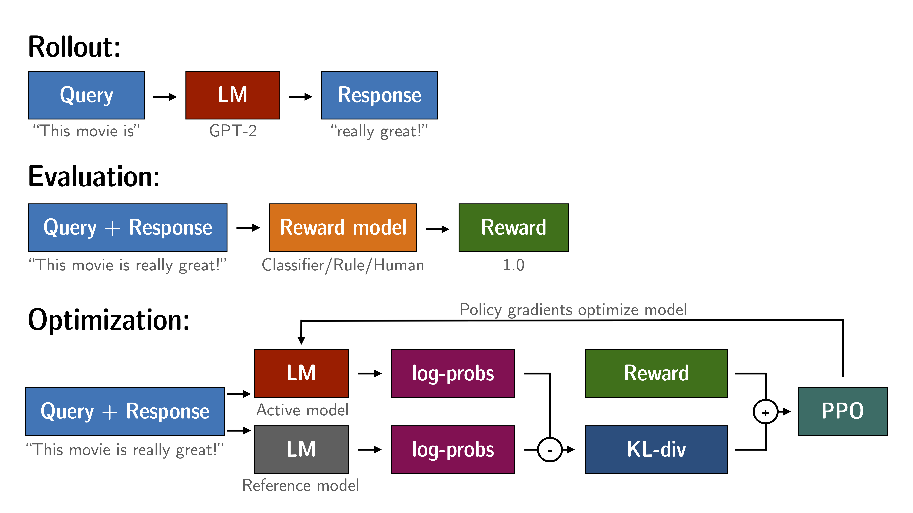
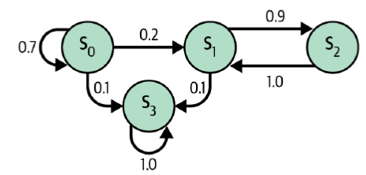
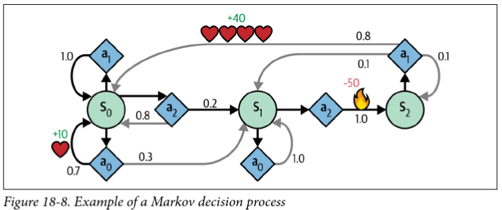

<!-- 
_class: invert lead
_paginate: skip
 -->

# (Deep) Reinforcement Learning

COMP 4630 | Winter 2025
Charlotte Curtis

---

## Overview

- Terminology and fundamentals
- Q-learning
- Deep Q Networks
- References and suggested reading:
    - [Scikit-learn book](https://librarysearch.mtroyal.ca/discovery/fulldisplay?context=L&vid=01MTROYAL_INST:02MTROYAL_INST&search_scope=MRULibrary&isFrbr=true&tab=MRULibraryResources&docid=alma9923265933604656): Chapter 18
    - [d2l.ai](https://d2l.ai/chapter_reinforcement-learning/index.html): Chapter 17

---

## Reinforcement Learning + LLMs
  

<footer>Source: <a href="https://huggingface.co/blog/trl-peft">Hugging Face</a></footer>

---

## Terminology

- **Agent**: the learner or decision maker
- **Environment**: the world the agent interacts with
- **State**: the current situation
- **Reward**: feedback from the environment
- **Action**: what the agent can do
- **Policy**: the strategy the agent uses to make decisions

> Classic example: [Cartpole](https://jeffjar.me/cartpole.html)

---

## The Credit Assignment Problem

* Problem: If we've taken 100 actions and received a reward, which ones were "good" actions contributing to the reward?
* Solution: Evaluate an action based on the sum of all future rewards
    - Apply a **discount factor** $\gamma$ to future rewards, reducing their influence
    - Common choice in the range of $\gamma = 0.9$ to $\gamma = 0.99$
    - Example of actions/rewards:
        - Action: Right, Reward: 10
        - Action: Right, Reward: 0
        - Action: Right, Reward: -50

---

## Policy Gradient Approach

* If we can calculate the gradient of the **expected reward** with respect to the **policy parameters**, we can use gradient descent to find the best policy
* Approach:
    1. Play the game several times. At each step, compute the gradient (but don't update the policy yet).
    2. After several episodes, compute each action's **advantage** (relative sum of discounted rewards).
    3. Multiply each gradient vector by the advantage
    4. Compute the mean of all gradients and update the policy via gradient descent

<!-- Example in notebook -->

---

## Markov Chains

* A **Markov Chain** is a model of random states where the future state depends **only** on the current state (a **memoryless** process)
    
* Used to model real-world processes, e.g. Google's [PageRank algorithm](https://www.sciencedirect.com/science/article/pii/S016975529800110X?via%3Dihub)
* :question: Which of these is the **terminal state**?

<footer>Figure 18-7 from the Scikit-learn book</footer>

---

## Markov Decision Processes

* Like a Markov Chain, but with **actions** and **rewards**
* Bellman optimality equation:
    $$V^*(s) = \max_a \sum_{s'}T(s, a, s')[R(s, a, s') + \gamma V^*(s')] \text{ for all } s$$

---

## Iterative solution to Bellman's equation
**Value Iteration**:
1. Initialize $V(s) = 0$ for all states
2. Update $V(s)$ using the Bellman equation
3. Repeat until convergence

$$V_{k+1}(s) \leftarrow \max_a \sum_{s'}T(s, a, s')[R(s, a, s') + \gamma V_k(s')] \text{ for all } s$$

> Problem: we still don't know the optimal policy

---

## Q-Values
Bellman's equation for Q-values (optimal state-action pairs):

$$Q_{k+1}(s, a) \leftarrow \sum_{s'}T(s, a, s')[R(s, a, s') + \gamma \max_{a'}Q_k(s', a')]$$

Optimal policy $\pi^*(s)$: 

$$\pi^*(s) = \arg\max_a Q^*(s, a)$$

For small spaces, we can use **dynamic programming** to iteratively solve for $Q^*$

---

## Q-Learning

* **Q-Learning** is a variation on Q-value iteration that learns the **transition probabilities** and **rewards** from experience
* An **agent** interacts with the environment and keeps track of the estimated Q-values for each state-action pair
* It's also a type of **temporal difference learning** (TD learning), which is kind of similar to stochastic gradient descent
* Interestingly, Q-learning is "off-policy" because it learns the optimal policy while following a different one (in this case, totally random exploration)

---

## Q-Learning Update rule
* At each iteration, the Q estimate is updated according to:
    $$Q(s, a) \leftarrow (1 - \alpha) \cdot Q(s, a) + \alpha \cdot [r + \gamma \cdot \max_{a'} Q(s', a')]$$

* Where:
    - $Q(s, a)$ is the estimated value of taking action $a$ in state $s$
    - $\alpha$ is the learning rate (decreasing over time)
    - $r$ is the immediate reward
    - $\gamma$ is the discount factor
    - $\max_{a'} Q(s', a')$ is the maximum Q-value for the next state

---

## Exploration policies

* :question: How do you balance short-term rewards, long-term rewards, and exploration?
* Our small example used a purely random policy
* $\epsilon$-greedy chooses to explore randomly with probability $\epsilon$, and **greedily** with probability $1-\epsilon$
* Common to start with high $epsilon$ and gradually reduce (e.g. 1 down to 0.05)

---

## Challenges with Q-Learning

* :question: We just converged on a 3-state problem in 10k iterations. How many states are in something like an Atari game?
* :question: How do we handle **continuous** state spaces?

One approach: **Approximate** Q-learning: 
* $Q_\theta(s, a)$ approximates the Q-value for any state-action pair
* The number of parameters $\theta$ can be kept manageable
* [Turns out](https://arxiv.org/abs/1312.5602) that **neural networks** are great for this!

---

## Deep Q-Networks
* We know states, actions, and observed rewards
* We need to estimate the Q-values for each state-action pair
* Target Q-values: $y(s, a) = r + \gamma \cdot \max_{a'}Q_\theta(s', a')$
    - $r$ is the observed reward, $s'$ is the next state
    - $Q_\theta(s', a')$ is the network's estimate of the future reward
* Loss function: $\mathcal{L}(\theta) = ||y(s, a) - Q_\theta(s, a)||^2$
* Standard MSE, backpropagation, etc.

---

## Challenges with DQNs
* **Catastrophic forgetting**: just when it seems to converge, the network forgets what it learned about old states and comes crashing down
* The **learning environment keeps changing**, which isn't great for gradient descent
* The **loss value** isn't a good indicator of performance, particularly since we're estimating both the target and the Q-values*
* Ultimately, reinforcement learning is inherently **unstable**!

---

<!-- 
_class: invert lead
_paginate: skip
 -->

 # The last topic: Geneterative AI and ethics