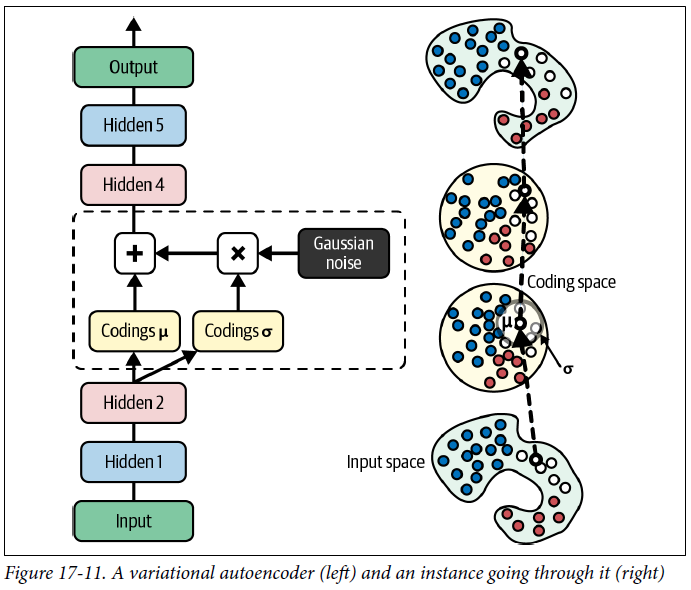

<!-- 
_class: invert lead
_paginate: skip
 -->

# Generative AI, ethics, and policies

COMP 4630 | Winter 2025
Charlotte Curtis

---

## Overview

- Discussion on AI usage, ethics, and policies
- Autoencoders
- Generative adversarial networks (GANs)
- Diffusion models
- References and suggested reading:
    - [Scikit-learn book](https://librarysearch.mtroyal.ca/discovery/fulldisplay?context=L&vid=01MTROYAL_INST:02MTROYAL_INST&search_scope=MRULibrary&isFrbr=true&tab=MRULibraryResources&docid=alma9923265933604656): Chapter 17
    - [Deep Learning book](https://www.deeplearningbook.org/): Chapter 14, 20

---

## Guiding questions for discussion
* :question: What are some ways that AI can be helpful? Harmful?
* :question: What are some ways that AI is used?
    - Axes: intent (malicious <-> innocent), impact (harmful <-> helpful)
* :question: What concerns do you have about AI in general?
    - What about in education, specifically at MRU?
* :question: What would you like to see in an AI policy at MRU?

---

## A case study on impact: Vibe coding

Costs* of:
- Voice to text
- Code generation
- Debugging
- at ~[3 Wh/request](https://www.sciencedirect.com/science/article/pii/S2542435123003653)

<footer>*Carbon footprint, $$, scalability, security, etc</footer>

---

## Autoencoders
* Like encoder-decoder networks, but the input and output are the same, minimizing:
    $$\mathcal{L}(\mathbf{x}, f(g(\mathbf{x})))$$
    where $f$ is the encoder and $g$ is the decoder
* Autoencoders have been around [since the 80s](https://link.springer.com/article/10.1007/BF00332918)
* :question: If we're just training a model to copy its input, what's the point?

---

## What can we do with autoencoders?
* Autoencoders learn a **latent space** representation of the data, provided the latent space is **lower dimension** than the input (undercomplete)
* **Regularization** can also help the model learn a useful representation
* Once trained, the model can be used for:
   - Data compression
   - Information retrieval
   - Anomaly detection
   - Unsupervised pretraining

---

## Unsupervised pretraining

* Rather than training (e.g.) a classifier from scratch, we can first train an **autoencoder**, then use the **encoder** part as the first half of the classifier
* :question: Why might this be useful?
* :question: What other applications can you think of?

<footer>Figure 17-6 from the Scikit-learn book</footer>

---

## More autoencoder tricks
* **Sparse autoencoders** introduce a sparsity penalty to the loss function:
    $$\mathcal{L}(\mathbf{x}, g(f(\mathbf{x}))) + \Omega(\mathbf{h})$$
    where $\mathbf{h} = f(\mathbf{x})$ and $\Omega$ is a sparsity penalty
* The model can now learn useful features without constraining latent dimensions
* **Weight tying** takes advantage of the symmetric nature of autoencoders by forcing the weights of the decoder to be the same as the encoder
* **Denoising autoencoders** can be created by adding noise to the input:
    $$\mathcal{L}(\mathbf{x}, g(f(\mathbf{\tilde{x}})))$$
* Autoencoders can also be CNNs, RNNs, or just about any other kind of network!

---

## Variational Autoencoders

* Encoder produces a **distribution** $(\mathbf{\mu}, \mathbf{\sigma})$
* Decoder samples from $N(\mu, \sigma)$ to produce the output
* Loss includes a **KL divergence** term to push the distribution towards normal

---

## Generative Adversarial Networks (GANs)
* VAEs can be used as generators (e.g. images), so how can we train them to generate what we actually want?
* In [2014](https://proceedings.neurips.cc/paper_files/paper/2014/hash/5ca3e9b122f61f8f06494c97b1afccf3-Abstract.html), Ian Goodfellow et. al proposed training two networks simultaneously: a **generator** and a **discriminator**
    - The generator tries to produce realistic looking images
    - The discriminator is trained to classify images as real or fake
* Two-phase training loop:
    - Equal numbers of real and fake images used to train discriminator
    - Discriminator weights frozen while generator produces images with label of "real" - backpropagation updates only generator weights

---

## GAN training challenges
* Training is a **zero-sum** game, where each "player" receives a payoff that the discriminator tries to maximize and the generator tries to minimize
* Equilibrium is reached when the discriminator performance is 50%, but **oscillations** can occur and convergence is not guaranteed
* **Mode collapse** happens when the generator figures out that it can produce a single image that fools the discriminator
* Still an active area of research!

> "And since many factors affect these complex dynamics, GANs are very
sensitive to the hyperparameters: you may have to spend a lot of effort fine-tuning them. In fact, that’s why I used RMSProp rather than Nadam when compiling the models: when using Nadam, I ran into a severe mode collapse." - Aurélien Géron

---

## Diffusion Models
* First formalized in [2015](https://arxiv.org/abs/1503.03585) by Jascha Sohl-Dickstein et. al
* Not popular until [2020](https://arxiv.org/abs/2006.11239) when Jonathan Ho et. al introduced **DDPM**
* Concept: take an image and gradually add noise until it's unrecognizable, then train a model to reverse the process
    

---

## CLIP guidance
* DDPM, GANs, and VAEs are all capable of generating images given a **class label** that is part of the training data
* Image generation + NLP = magic
* Contrastive Language-Image Pretraining [CLIP](https://arxiv.org/abs/2103.00020) was trained on 400 million image-caption pairs to predict which caption goes with which image
* Final result is a general purpose model that can go both ways
* Actually [open sourced](https://github.com/OpenAI/CLIP) by OpenAI!

---

<!-- 
_class: invert lead
_paginate: skip
 -->

## That's all, next up is your project presentations!